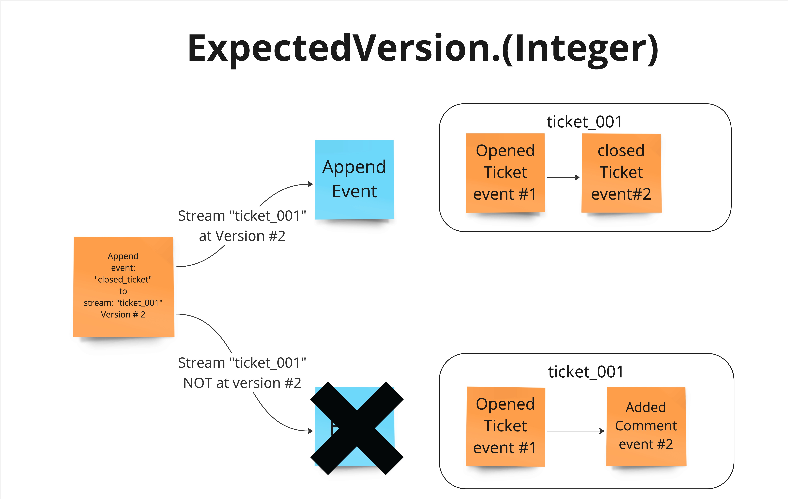
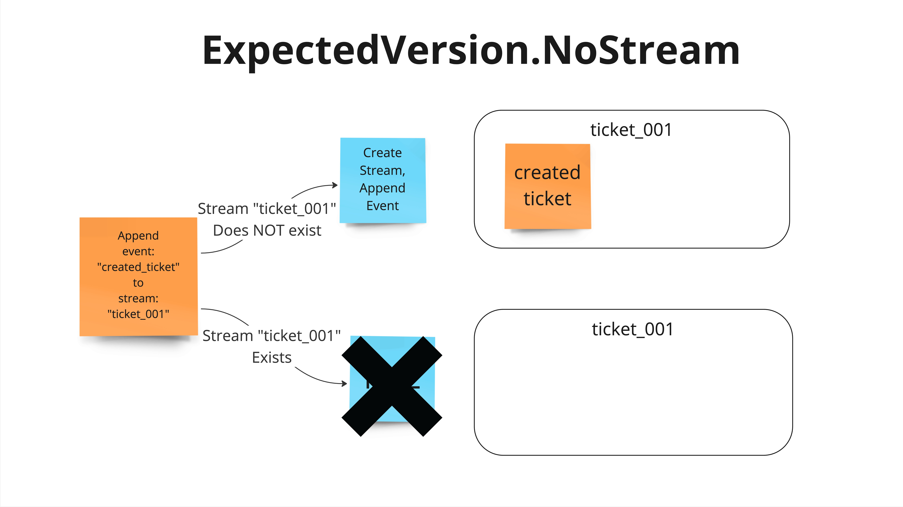
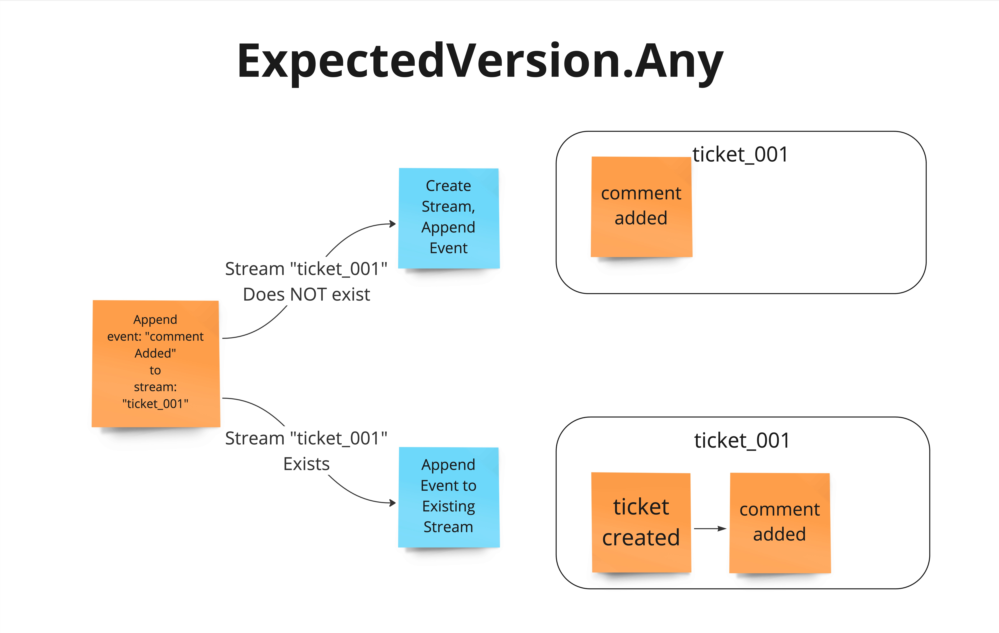

# Concurrency

---
layout: main-full
---

KurrentDB supports an Optimistic Concurrency Check on appends.

This Module will demobnstrate the available features.

---
layout: main-full
---

# Table of Contents
1. What is Concurrency Control
2. Scope of Concurrency Check
3. Effect on stream design

---
layout: main-full
---

# Optimistic Concurrency Control Defined

Instead of locking first in order to guarantee success of a transaction, OCC assume success (that is the optimistic part) and fails the transaction if a conflict is detected.

---
layout: main-full
---

# Pessimistic Concurrency Control Defined

Lock the record for your exclusive use until you have finished with it.

---
layout: main-full
---

# When are the Concurrency checks made?

The concurrency check is defined on the write of an event. If the concurrency check fails then the write of that event fails.

---
layout: main-full
---

# Scope of Concurrency checks

A concurrency check can be made per write, to a single stream. 

There are no cross stream concurrency checks. 

This behavior is similar to other systems such as document databases. 

Allows you to ask the question "has the stream been modified by some other process since I read it"

Allows operations against a single stream to be "consistent" as in "ACID".

Operations across streams will be "eventually consistent", as in AWS object storage.

---
layout: main-full
---

# Available Settings

* Any Integer Value (`expectedRevision: n`)
    * Must be that Event Number  
* `ExpectedVersion.NoStream / StreamState.No_Stream`
  * Stream Does Not Exist Yet  
* `ExpectedVerstion.streamExists/StreamState.Exists`
    * Stream Exists, **Event number** not checked 
* `ExpectedVersion.Any` / `StreamState.Any`
   * *Disables* concurrency Check        

---
layout: main-full
---

# Event ID

Although not specifically a concurrency check, you should be aware that

* Event Ids are a UUID, unique over the store, supplied by the writer.
* If there are two writes in rapid succession with the same Event ID, the server may write only one of the events to disk.
* If you do not provide an EventID, the client will assign one.
* Best practice is to generate and manage the Event ID in your application.

---
layout: main-full
---

# Use Case for this example

Issue/support ticket management system

* Streamname = Support ticket id
* EventTypes [TicketCreate, TicketComment, TicketAssigned, TicketClosed]

---
layout: main-full
---

# Example Stream

---
layout: section
---

# Examples 

The following slides are examples of each of the settings

---
layout: main-full
---

# Integer Value

* This is the most commonly used setting for most applications.
* It is typically used to guarantee the state of the stream has not changed between the time that you read and the time that you write.

---
layout: center
---

---
layout: main-full
---

# Use Case

* A stream is created when a user fills out a web form to open a support ticket. 
* Any one of the Support Engineers can view the ticket and assign it to themselves. 
* When closing a ticket the it is important that the support engineer has read all the issues present in the stream. Using ExpectedVersion.(Integer) can guarantee that. 

* Bonus Question: Which other EventType in this use case would use expected.Version = integerValue

---
layout: main-full
---

# No Stream

Specifies the expectation that the target stream does not yet exist.

---
layout: main-full
---

# Use Case

* Used when you want your application to create a new stream, by appending an event to it. If a stream of that name has already been created you want the operation to fail.
* For our ticketing system application this might be used when the customer first creates the ticket. 

<!-- 
In our use case of support tickets multiple customers may be using the application at once. If our application issues ticket numbers incrementally, for example ticket_01, ticket_02, ticket_03 etc. In that case if there is a race condition to create ticket_04, one operation will succeed, and the other will have to retry.
-->

---
layout: center
---

---
layout: main-full
---

# Stream Exists

Specifies the expectation that the target stream or its metadata stream has been created, but does not expect the stream to be at a specific event number.

<!-- The Stream Exists Concurrency check sets the expectation that the stream your application is appending an event to, must already exist.
-->

---
layout: main-full
---

# Use Case

You would use this when you want to guarantee the stream exists before writing your event. 

In our Support Ticket System example, TicketComment events might use this level of concurrency check.

Multiple comment events from multiple sources could be appended to the stream without regards to other TicketComment events occurring. 

The risk is that TicketComment events might be appended after a TicketClosed event. 

---
layout: center
---

---
layout: main-full
---

# Expected Version Any

* Disables concurrency check
* This is the most liberal setting
* It is often used for examples and demos, but in most cases your application will want to perform some sort of check

---
layout: center
---

