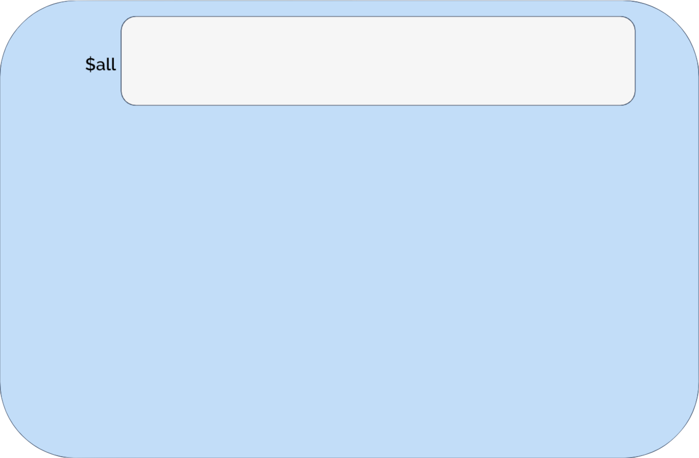
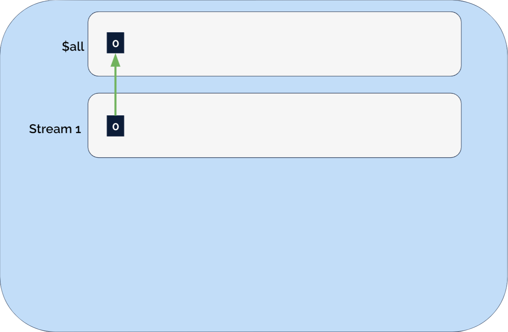
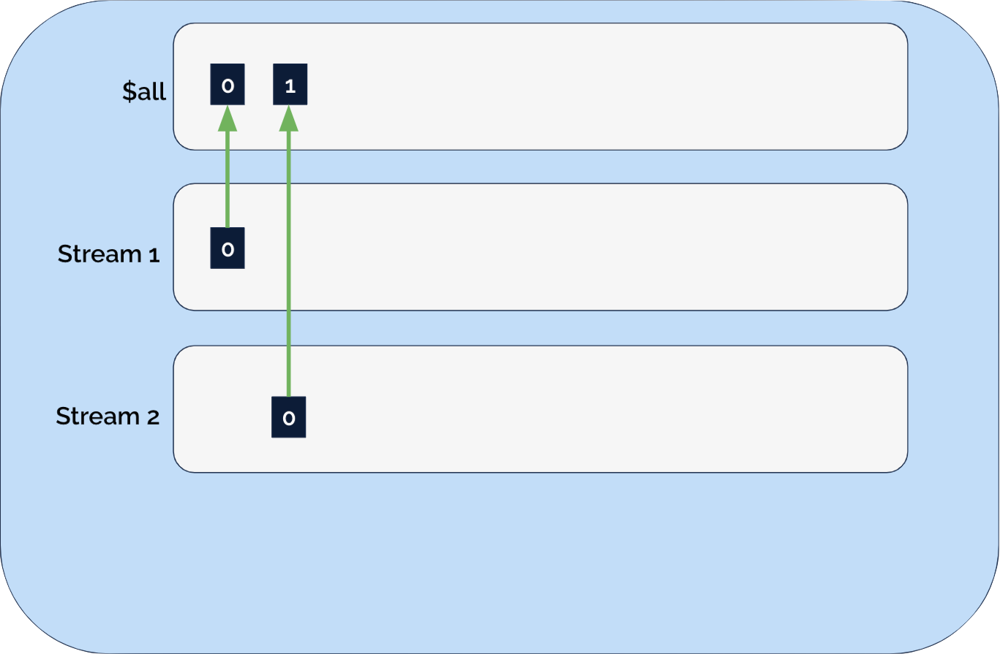
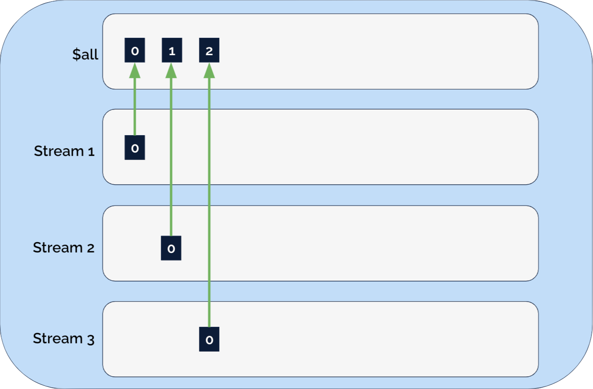
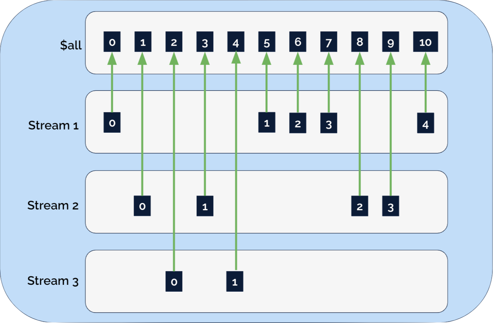

# Stream Details

---
layout: main-full
---

# Table of contents

1. The $all stream
2. Stream implementation internals

---
layout: main-full
---

# KurrentDB Internals: Streams and Events Summary

* An Event is part of a stream 
* An Event is an entry in a global log known as the $all stream 
* A stream is a subset of the $all stream
* The index contains information on which events are in which stream

---
layout: main-full
---

# The $all stream

* A log of all events appended to all streams
* Includes system events
* Can be read in a manner similar to reading named streams

---
layout: main-full
---

# Named Stream Implementation Details

A Stream is implemented internally as:

* Index entries in an LSM structured index
* Index is pointer from StreamName+Event number to position in $all stream

---
layout: center
---

# Streams Illustrated

---
layout: center
---

# Streams Illustrated

---
layout: center
---

# Streams Illustrated

---
layout: center
---

# Streams Illustrated

---
layout: center
---

# Streams Illustrated

