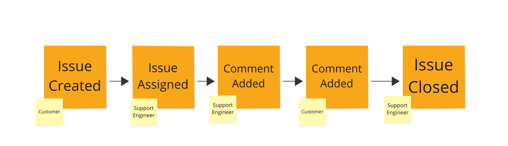

# Streams

---
layout: main-full
---

# Table of Contents

1. Definition
2. Examples
3. Naming Streams


---
layout: main-full
---

# Stream Definition:


Streams are:
* Collection of ordered events
* Fine-grained
* Subscribeable
* Unit of consistency guarantees
* Created when an event is appended to it

---
layout: main-full
---

# Fine-grained Streams


A well designed KurrentDB application will typically revolve around a collection of fine grained streams. 


---
layout: main-full
---

# A Stream Example

Issue/support ticket management system

* Streamname = Support ticket id
* EventTypes [TicketCreate, TicketComment, TicketAssigned, TicketClosed]

---
layout: main-full
---

# Example Stream




---
layout: main-full
---

# Example

## Ticket/Stream created with `TicketCreated` event


|No | Stream | Type | Timestamp| 
|---| ----- |-----|---|
|0  | ticket_0001 | TicketCreated | 2025-01-09 19:13:13|

Data:

```
{"user": "tom",
  "customer_id": "1",
  "Issue summary": "When I create a new user I get a \"quota exceeded error\" ",
  "time stamp": "1736467966"}
```

---
layout: main-full
---

# Example

## Support Engineer is assigned the ticket with `TicketAssigned` event


|No | Stream | Type | Timestamp| 
|---| ----- |-----|---|
|1  | ticket_0001 | TicketAssigned | 2025-01-09 19:20:01|

Data:

```
{"Support Engineer": "Harsh",
 "Support Level": 3}
```

---
layout: main-full
---

# Example

## Support Engineer is assigned the ticket with `TicketAssigned` event


|No | Stream | Type | Timestamp| 
|---| ----- |-----|---|
|1  | ticket_0001 | TicketAssigned | 2025-01-09 19:20:01|

Data:

```
{"Support Engineer": "Harsh",
 "Support Level": 3}
```

---
layout: main-full
---

# Example

## Comment added by support engineer appending a `TicketComment` event


|No | Stream | Type | Timestamp| 
|---| ----- |-----|---|
|2  | ticket_0001 | TicketComment | 2025-01-09 19:30:01|

Data:

```
{"Reporter": "Harsh",
  "Employee or Customer Comment": "Employee",  
 "Comment Text": "Looks like old version of client, suggest upgrade"}
```

---
layout: main-full
---

# Example

## Comment added by customer appending a `TicketComment` event


|No | Stream | Type | Timestamp| 
|---| ----- |-----|---|
|3  | ticket_0001 | TicketComment | 2025-01-09 19:35:21|

Data:

```
{"Reporter": "Tom Hanlon",
  "Employee or Customer Comment": "Customer",  
 "Comment Text": "Looks like we are using the old version, our mistake"}
```

---
layout: main-full
---

# Example

## Ticket closed by support engineer appending a  `TicketClosed` event


|No | Stream | Type | Timestamp| 
|---| ----- |-----|---|
|4  | ticket_0001 | TicketClosed | 2025-01-09 19:35:21|

Data:

```
{"Reporter": "Harsh"}
```

---
layout: main-full
---

# Naming Streams

* `$` prefix is reserved for system streams
* avoid "/" in stream name, as stream name is part of a url for http api calls
* `<category> - <detail>` naming is often used
  * user-001, user-002, user-003 etc
  * enables category projection