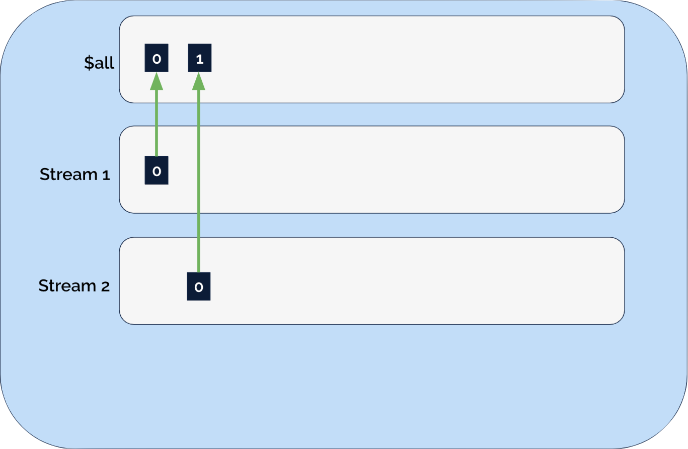
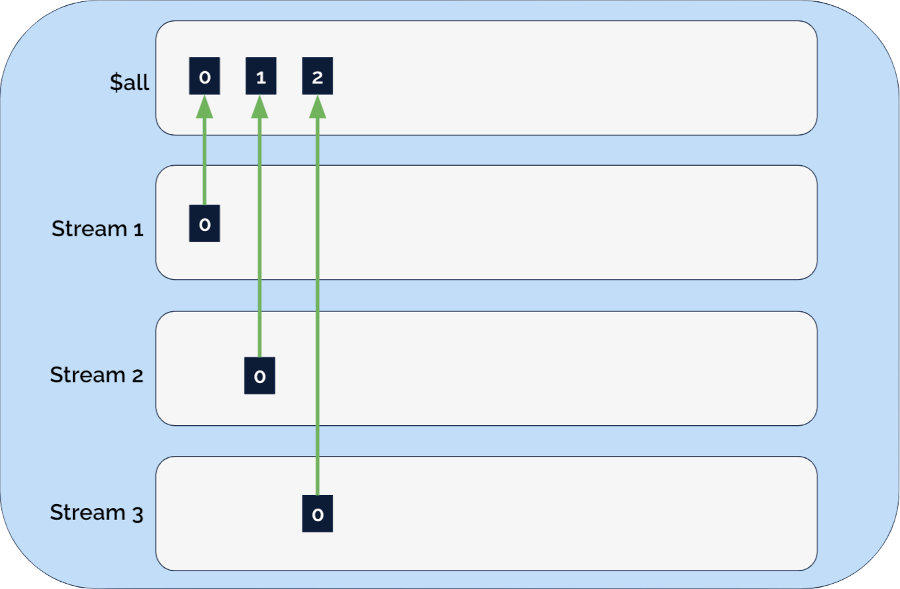

---
layout: cover
---


# KurrentDB Overview


---
layout: main_full
---


# In This Section You Will Learn how to:


* Differentiate the unique functionality of KurrentDB from other systems
* Install KurrentDB from a binary distribution
* Add events to KurrentDB streams
* Configure stream settings to delete old events
* Use the EventStorDB webui


---
layout: two-cols
---

# Left

This shows on the left

::right::


This shows on the right

---
layout: two-cols-header
---

# Outline

::left::

* KurrentDB overview
* KurrentDB comparison to other DBs 
* Introduction to events and streams
* Concurrency
* KurrentDB internals 
* Events
* Reading streams
* Database configuration
* Lab: Install KurrentDB
* Truncate, delete, and configure streams
* Subscriptions
* Projections:  System & User Defined


::right::
* Lab: Exploring the Projection Engine
* KurrentDB internals:  Storage on Disk
* Lab: Files used by KurrentDB
* Truncate, delete, and configure streams
* Subscriptions
* Projections:  System & User Defined
* Lab: Exploring the Projection Engine
* KurrentDB internals:  Storage on Disk
* Lab: Files used by KurrentDB
* Write path

---
layout: two-cols-header
---

# Outline

::left::
* Read path
* System streams
* Stream access control
* Lab: Modify stream access control List
* Lab (optional): Stress test the server 


---
layout: section
---


# KurrentDB Overview

## 


---
layout: main_full
---


# KurrentDB


**Designed for event-native applications, KurrentDB immutably stores every event to provide:**  


* Context rich business data 
* Decoupled complex systems 
* Increased scalability and flexibility
* Contextual, real-time insights
* Future proofed architecture


---
layout: main_full
---


# KurrentDB Server: Deployment Options


**KurrentDB**

* Compatible with Docker, Linux, Windows
* Open Source and free to use
    * As of 24.10, [ESLv2 license model](https://www.eventstore.com/blog/introducing-event-store-license-v2-eslv2)
* Enterprise Offerings
* Self-managed on-prem or cloud


**KurrentDB Cloud**

* AWS, Azure, Google
* Security and Compliance
* Scalability and High Availability
* Managed Service


 ---

 
 # KurrentDB Clients
 
 
 


 **GRPC based clients**

* Node.js
* .NET
* Java
* Python
* Rust
* Go

 


 
 **HTTP API**

 * Read/Write events
 * Admin functions
 * Add users/groups
 * Enable/Disable features
 * Retrieve logs/metrics


---
layout: main_full
---


# KurrentDB


**Builds Data Immutability**
KurrentDB stores data as a series of immutable events over time to provide for greater data integrity and transparency.


**Decouples Core Logic**
With KurrentDB you can decouple your external systems with asynchronous messaging making your system cleaner and more compact.


**Creates a Source of Truth**
Events in KurrentDB are stored as a reliable log of the changes in your application. 


---
layout: section
---


  
 

    

# Comparing KurrentDB 
# to Other Systems

## 

---
layout: main_full
---


# Key Concepts


When using any database (SQL, Document, NoSQL, or KurrentDB), its critical to understand the tools available to: 


* Manage potential conflicts between multiple readers and writers
* Enforce constraints
* Retrieve data or subsets of data
* Deletion process


This section discusses those concepts and compares KurrentDB to other types of databases.   


---
layout: main_full
---


# How Data is Stored


Some systems store data as a document that can be read and rewritten as a new version. Others store data as a table with a collection of rows containing typed columns. 

This section breaks down the topic into:

* Unit of storage
* Available operations
* Schemas
* Pub-sub functionality


---
layout: main_full
---


# KurrentDB: Unit of Data Storage


**Comparing databases and their basic units of storage**


| Database Type | Base Unit of Storage| 
|---------------|---------------------|
|Relational database (MySQL, Postgres, Oracle)|Rows
|Document store(MongoDB, Cosmos)|Documents
|Data lake |Combination of documents and rows
|KurrentDB| Events |


---
layout: main_full
---


# Event Details


* Appended in order to a stream
* Immutable


---
layout: main_full
---


# Comparison by Supported Operations


Some systems allow granular updates/deletes.  Others group data into subsets and allow granular updates/deletes on those subsets. 

Some systems allow updates of previously written data in place.  Others replace the previous version with a new version containing the update/delete.

The following slide(s) summarize those differences


<!-- Instructor Note
This is key to enabling proper understanding and use of KurrentDB, certain classes may already understand the differences, but it is critical to have a baseline understanding, go as deep or as shallow as the class requires  -->

---
layout: main_full
---


# Overview of KurrentDB, Supported Operations


| Database Type| Supported Operations |
|--------------|----------------------|
|Relational database (MySQL, Postgres, Oracle)|Create, Read, Update, Delete (rows)|
|Document store (MongoDB, Cosmos)|Create, Read, Update, Delete (documents) |
|Data lake |Create, Read, Update, Delete (combination)|
|KurrentDB|Create(append), Read, Delete* (events)|


---
layout: main_full
---


# Schemas

**Systems that enforce schemas on write**

* Relational databases

**Systems that define schema on read**

* Data Lakes *(Typically SQL layers over semi-structured distributed storage)* 


**KurrentDB**

* KurrentDB neither manages or enforces schemas
* Schema enforcement/management is the responsibility of the application


---
layout: main_full
---


# Reading Data


|Database Type | Read Path | Subscriptions |
|--------------|-----------|---------------|
| Relational | Granular reads or scans/joins with filters interpreted and applied by the server | No subscriptions |
| NoSQL | Differs per system | Differs per system |
| KurrentDB | Read Stream/projection sequentially forwards/backwards | Subscriptions to streams/projections |


---
layout: main_full
---


# Data Transformations on Write


|Database Type | Write Transformation | 
|--------------|-----------|
| Relational | Triggers, Stored Procedures |
| NoSQL | Differs per system | 
| Data Lake | Differs per system |
| KurrentDB | Projections |


---
layout: section
---

    

# Events & Streams

##

---
layout: main_full
---


# Introduction to Events and Streams


Since KurrentDB Stores immutable events appended to streams, lets start with a review of each item. 

* Events
* Streams


---
layout: main_full
---


# Events


**General definition**

Events are schema-less, immutable bytes appended in order and guaranteed to be retrieved in that order. 


**The nuance of events**

Events represent meaningful actions that happened at a specific time and altered the state of a business entity. Events can contain all the relevant information about the action or decision that occurred, allowing future systems or services to understand the circumstances in which the event happened. 


---
layout: main_full
---


# Events: Bytes or JSON


Events are stored as **bytes**, but frequently JSON format is used. 


Some internal KurrentDB subsystems expect, or generate, JSON formatted events. 


---
layout: main_full
---


# Events Review


Events are:
* Immutable
* Ordered
* Schemaless
* Stored in a stream 


---
layout: main_full
---


# Streams


Events are sequentially organized into logical streams containing related events.


Streams are:
* Fine-grained
* Subscribeable
* Unit of consistency guarantees
* Created when an event is appended to it


---
layout: main_full
---


# Fine-grained Streams


A well designed KurrentDB application will typically revolve around a collection of fine grained streams. 


---
layout: main_full
---


# Streams:  Subscribable


KurrentDB in addition to storing immutable, consistently ordered events also has pub-sub funcionality


**Subscription Levels**
* $all stream
* Individual stream
* Projection


---
layout: section
---

# Concurrency

KurrentDB supports an Optimistic Concurrency Check on appends.

This Module will demobnstrate the available features.

---
layout: main_full
---


# Optimistic Concurrency Control Defined


Instead of locking first in order to guarantee success of a transaction, OCC assume success (that is the optimistic part) and fails the transaction if a conflict is detected.


---
layout: main_full
---


# Pessimistic Concurrency Control Defined


Lock the record for your exclusive use until you have finished with it.


---
layout: main_full
---


# When are the Concurrency checks made?


The concurrency check is defined on the write of an event. If the concurrency check fails then the write of that event fails.


---
layout: main_full
---


# Available Settings


* Any Integer Value (`expectedRevision: n`)
    * Must be that Event Number  
* `ExpectedVersion.NoStream / StreamState.No_Stream`
  * Stream Does Not Exist Yet  
* `ExpectedVerstion.streamExists/StreamState.Exists`
    * Stream Exists, **Event number** not checked 
* `ExpectedVersion.Any` / `StreamState.Any`
   * *Disables* concurrency Check        


---
layout: main_full
---


# Event ID


Although not specifically a concurrency check, you should be aware that

* Event Ids are a UUID, unique over the store, supplied by the writer.
* If there are two writes in rapid succession with the same Event ID, the server may write only one of the events to disk.
* If you do not provide an EventID, the client will assign one.
* Best practice is to generate and manage the Event ID in your application.


---
layout: main_full
---


# Use Case for this example


Issue/support ticket management system

* Streamname = Support ticket id
* EventTypes [TicketCreate, TicketComment, TicketAssigned, TicketClosed]


---
layout: main_full
---


section {
  display: flex;
  flex-direction: column;
  justify-content: center;
  text-align: center;
}


# Example Stream


---
layout: section
---


# Examples 

The following slides are examples of each of the settings


<!-- 
In the following slides we will review examples of each setting.

 -->
---
layout: main_full
---


# Integer Value


* This is the most commonly used setting for most applications.
* It is typically used to guarantee the state of the stream has not changed between the time that you read and the time that you write.


---
layout: main_full
---


# Use Case


* A stream is created when a user fills out a web form to open a support ticket. 
* Any one of the Support Engineers can view the ticket and assign it to themselves. 
* When closing a ticket the it is important that the support engineer has read all the issues present in the stream. Using ExpectedVersion.(Integer) can guarantee that. 


* Bonus Question: Which other EventType in this use case would use expected.Version = integerValue


---
layout: main_full
---


---
layout: main_full
---


# No Stream


Specifies the expectation that the target stream does not yet exist.


<!-- 
 -->

---
layout: main_full
---


# Use Case


* Used when you want your application to create a new stream, by appending an event to it. If a stream of that name has already been created you want the operation to fail.
* For our ticketing system application this might be used when the customer first creates the ticket. 


<!-- 
In our use case of support tickets multiple customers may be using the application at once. If our application issues ticket numbers incrementally, for example ticket_01, ticket_02, ticket_03 etc. In that case if there is a race condition to create ticket_04, one operation will succeed, and the other will have to retry.

 -->

---
layout: main_full
---


 


---
layout: main_full
---


# Stream Exists


Specifies the expectation that the target stream or its metadata stream has been created, but does not expect the stream to be at a specific event number.


<!-- The Stream Exists Concurrency check sets the expectation that the stream your application is appending an event to, must already exist.
-->


---
layout: main_full
---


# Use Case


You would use this when you want to guarantee the stream exists before writing your event. 

In our Support Ticket System example, TicketComment events might use this level of concurrency check.

Multiple comment events from multiple sources could be appended to the stream without regards to other TicketComment events occurring. 

The risk is that TicketComment events might be appended after a TicketClosed event. 


---
layout: main_full
---


---
layout: main_full
---


# Expected Version Any


* Disables concurrency check
* This is the most liberal setting
* It is often used for examples and demos, but in most cases your application will want to perform some sort of check


---
layout: main_full
---


<!-- 
This diagram shows what would happen if our support ticket system disabled concurrency checks on comment added events. 

As you see a ticket stream may be  created that starts with a Comment Added event rather than a ticket created event.
 -->

---
layout: cover
---

    

# Deleting Events

Stream Configuration

---
layout: main_full
---


# Event Removal Triggers


* Stream Deletion
    * Hard
    * Soft
* Stream Configuration
    * MaxAge
    * MaxCount    


---
layout: main_full
---


# Stream Configuration


Each stream has an optional metadata stream for configuration

\$$<Stream_Name>


Commonly used stream settings:

* **maxAge**
    * Older events are deleted  

* **maxCount**
    * Events are deleted that violate maxCount

* **ACL**
    * Access Control List


---
layout: section
---

# KurrentDB Internals


---
layout: main_full
---


# KurrentDB Internals: Event Management


 

* KurrentDB is a sequenced log of events
* As events are written, they are appended to a global log
* The global log contains all user and system generated events
* The global log can be read as the $all stream
* Events are stored in consistent order
* Events have a permanent sequence number
* LSM(Log Structured Merge Tree) structure 


---
layout: center
---


# Streams Illustrated


---
layout: center
---


# Streams Illustrated


---
layout: center
---


# Streams Illustrated





---
layout: center
---


# Streams Illustrated




---
layout: center
---


# Streams Illustrated


---
layout: main_full
---


# KurrentDB Internals: Streams and Events


* An Event is part of a stream 
* An Event is an entry in a global log known as the $all stream 
* A stream is a subset of the $all stream
* The index contains information on which events are in which stream


---
layout: main_full
---


# KurrentDB Optimizations


**General Considerations**


* Durability (Crash tolerance)
* Disk access patterns
    * Sequential reads
    * Random seeks 

<!-- 
Instructor should be able to describe the general aspects of these terms  

The main point is that the append only log is sequential write, and the structure of a stream is more or less sequential-ish reads. 

The LSM structure was designed for these issues
-->


---
layout: main_full
---


# KurrentDB Optimizations


KurrentDB has the following design features: 


* Pre-allocated append-only log that enables high throughput and sequential writes 
* Log-structured merge-tree(LSM) for high write capacity for the additional data storage (stream indexes)


<!-- The pre-allocated log avoids fragmentation, favoring sequential reads 
* It is beyond the scope of this course to go into details of LSM’s, but RocksDB is a widely used system, that also makes use of LSM’s https://rocksdb.org/
* And this site is useful, https://disc-projects.bu.edu/compactionary/index.html, and this animation is great https://disc-projects.bu.edu/compactionary/research.html -->


---
layout: section
---


# Event Details

##

---
layout: main_full
---


# Event Details:


* **Type**: A string, defined by the application
* **Stream**: The stream the event belongs to
* **Id**: UUID string, unique over the store *(typically generated by the client)*
* **Revision**: A number representing the position in the specific stream this event is part of.
* **Data**: A ByteArray of application generated data (often JSON formatted)


---
layout: main_full
---


# Event Details


* **Metadata**: A ByteArray of user or system generated metadata
    * **System metadata**
        * **Timestamp**: The date and time when the event was appended to the store, controlled by the database
    * **Application Metadata**: 
        * Any application-level metadata, no assumptions should be made on the data format
        * **CorrelationId**: supplied by the application
        * **CausationId**: supplied by the application


---
layout: main_full
---
 


# Event Details


* **Event ID**: (GUID) can be used for deduplication when appending data to the store
* **Revision #**: Typically used for optimistic locking
* **System metadata timestamp**: In the system metadata should never be used for application-level purposes
* **Revision & positions**: Are strictly increasing in their respective streams
    * These numbers are managed by the Event Store server only.


---
layout: main_full
---


# Properties of an Event


**Immutable**: Once an event is written it can not be modified

**Guaranteed Order**: The ordering of events is global across all events and streams in the database


---
layout: main_full
--- 


# Event Example: Support Ticket


|No | Stream | Type | Timestamp| 
|---| ----- |-----|---|
|0  | ticket_0001 | TicketCreate | 2025-01-09 19:13:13|

Data:

```
{
  "user": "tom",
  "customer_id": "1",
  "Issue summary": "When I create a new user I get a \"quota exceeded error\" ",
  "time stamp": "1736467966"
}
```
Metadata:
```
{}
```
EventId:	46765067-5067-5067-5067-173646765067

---
layout: main_full
---


# Deleting Events

Event deletion occurs when:


* Event is older than $maxAge stream setting
* Event violates $maxCount stream setting
* The stream itself is deleted


---
layout: section
---

 

# Reading Streams


---
layout: main_full
---


# Reading Streams


The following options are availalbe when reading a stream:


* Read forward 
* Read backward
* Read n number of events
* Start reading from any position in the stream


---
layout: main_full
---


# Reading streams: example code


Starting from a particular location, reading backwards, limit 100 events


```
events = client.get_stream(
    stream_name="demo",
    stream_position=2,
    limit=100,
    backwards=True
)


```


---
layout: main_full
---


# Reading the $all stream


When reading from the $all stream, you must provide byteoffset of the event instead of event number


event_all = client.read_all(commit_position=955159)

for event in event_all:
     # Doing something productive with the event
     print(f"Event: {event}")


---
layout: section
---


# Database Configuration 


---
layout: main_full
---


# Configuration Sources


* Configuration file
* Command line
* Environment variables


---
layout: main_full
---


# Configuration Precedence


1 - Command line options
2 - Environment variables
3 - Configuration files (YAML and JSON)


This order of precedence allows for flexible configuration management, where you can set default values in configuration files, override them with environment variables if needed, and use command line options for the highest priority settings.


---
layout: main_full
---


# Common Configuration Options


* [**ClusterSize**](https://developers.eventstore.com/server/v24.10/configuration/cluster.html#cluster-size):  Number of nodes in the cluster (excludes read-only replicas)
* [**DiscoverViaDns**](https://developers.eventstore.com/server/v24.10/configuration/cluster.html#cluster-with-dns): Whether to enable DNS discovery
* [**GossipSeed**](https://developers.eventstore.com/server/v24.10/configuration/cluster.html#cluster-with-gossip-seeds): A list of hosts to gossip to (when DNS discovery is disabled)
* [**ClusterDns**](https://developers.eventstore.com/server/v24.10/configuration/cluster.html#cluster-with-dns): The DNS discovery endpoint (when DNS discovery is enabled)


---
layout: main_full
---


# Common Configuration Options


**IP / Hostname settings**

* [**ReplicationIp**](https://developers.eventstore.com/server/v24.10/configuration/networking.html#interface-and-port) (formerly IntIp): IP address to bind to for internal node-to-node communication
* [**NodeIp**](https://developers.eventstore.com/server/v24.10/configuration/networking.html#http-configuration) (formerly ExtIp): IP address to bind to for node-to-node and node-to-client communication
    * *ReplicationIp and NodeIp will be the same if you are using a single network interface (which is true for most configurations)*
* **NodeHostAdvertiseAs** (previously ExtHostAdvertiseAs): The hostname to advertise the node as on the gossip endpoint. This is usually changed to the node’s hostname when you are using certificates to prevent certificate name mismatches.
* **AdvertiseHostToClientAs**: The hostname to advertise the node as on the client gossip endpoint. This is usually used when clients are connecting behind a NAT or set to match the node’s hostname when using certificates.


---
layout: main_full
---


# Common Configuration Options


* [**Log rotation**](https://developers.eventstore.com/server/v24.6/diagnostics/logs.html#log-file-interval) (LogFileSize, LogFileInterval, LogFileRetentionCount)
* [**ReaderThreadsCount**](https://developers.eventstore.com/server/v24.10/configuration/#readerthreadscount)
    * Can be increased if reader threads are saturated
* **Projection settings**
    * RunProjections - whether to start the projection subsystem
    * StartStandardProjections - whether to start the built-in system projections


---
layout: main_full
---


# Commonly used configuration options


* [SkipIndexVerify](https://developers.eventstore.com/server/v24.10/configuration/indexes.html#skip-index-verification)
* Certificate settings 
* [CachedChunks / ChunksCacheSize](https://developers.eventstore.com/server/v24.10/configuration/db-config.html#chunk-cache)
* [StreamInfoCacheCapacity](https://developers.eventstore.com/server/v24.10/configuration/#streaminfocachecapacity)
* [EnableExternalTcp](https://developers.eventstore.com/server/v24.10/configuration/networking.html#external-tcp)
* Timeout settings


---
layout: main_full
---


<!-- _footer: 
 -->


# Lab: Install KurrentDB


## See the labs folder on the desktop


---
layout: main_full
---


# Lab: Install KurrentDB


Please open
`lab_install_esdb`
in your Labs folder.


Lab Summary: 

1. Un-archive a pre downloaded binary

2. Append an event using the Webui


---
layout: intro
---

   

# Truncating, Deleting, and Configuring Streams

## 

---
layout: main_full
---


# Configuration Options


**Streams can be configured to:**
* Only return x number of events by setting $maxCount
* Only return the most recent events by setting $maxAge
 

It is important to note that events will persist in the $all stream until a scavenge operation rewrites the log. Scavenge is covered later in the course. 


**Streams can be Deleted**
* [Soft Delete](https://developers.eventstore.com/clients/grpc/delete-stream.html#soft-delete): Truncates the stream allowing future event appends to that stream
* [Hard Delete](https://developers.eventstore.com/clients/grpc/delete-stream.html#hard-delete) ("Tombstone"): Permanently removes a stream and its events. When a stream is hard deleted, you cannot reuse the stream name, it will raise an exception if you try to append to it again. 


---
layout: main_full
---


# Stream Configuration Internals


Streams are configured by appending an event to the `$$` system stream
* \$\$ streams are hard coded to return only a single event
* JSON formatted
* JSON elements used by the system include
    * $maxAge
    * $maxCount
    * Access Control Configuration


---
layout: intro
---

   

# Subscriptions

##

---
layout: main_full
---


# Subscriptions


Clients can subscribe to a stream and receive newly appended events as they arrive.

Supported Features of subscriptions include:
* Subscribe to a named stream
* Subscribe to the $all stream
* Persistent Subscriptions
    * ESDB server tracks subscribers progress (manages state)
* Catch-up Subscriptions
    * Application tracks progress (manages state)


---
layout: intro
---

 

# Projections

##

---
layout: main_full
---


# Projections


KurrentDB supports two types of projections:

* System Projections
* User Defined Projections


---
layout: main_full
---


# System Projections


KurrentDB has a  projections subsystem that lets you append new events or link existing events to streams in a reactive manner. Projections require the event body to be in JSON.

Available projections include:
* By Category ($by_category)
* By Event Type ($by_event_type)
* By Correlation ID ($by_correlation_id)
* Stream by Category ($stream_by_category)
* Streams ($streams)


---
layout: main_full
---


# Projection by Category ($by_category)


Events appended into following streams:
* usa-customer1
* usa-customer2

Would be projected into the stream:
* $ce-usa


---
layout: main_full
---


# Projection by Event Type ($by_event_type)


Events with the event type "SALE" appended into any stream  would be projected into the stream $et-SALE.


---
layout: main_full
---


# Projection by Correlation ID ($by_correlation_id)


Events sharing a $correlationID value "X" in the event metadata that are appended into any stream would be projected into the stream $bc-X.

The projection takes one parameter, a JSON string as a projection source:

```
{
  "correlationIdProperty": "$myCorrelationId"
}
```


---
layout: main_full
---


# Projection Stream by Category ($by_category)


The [stream by category](https://developers.eventstore.com/server/v24.10/features/projections/system.html#stream-by-category) projection links existing events from streams to a new stream with a $category prefix by splitting a stream id by a configurable separator.

The separator as well as where to split the stream id are configurable.


---
layout: main_full
---


# Streams Projection ($streams)


This projection links existing events from streams to a stream named $streams. This will contain all events in all streams.


---
layout: main_full
---


# User-defined Projections


Just like an application can manage it’s own subscription by storing the offset, an application may read events or subscribe to streams and append new events or create new streams of events based upon logic applied to the events read. 


---
layout: main_full
---


# Projection API


A projections API is available for user defined projections that offers: 

* Custom projections
* Flexible JSON configuration


[See Documentation for additional information](https://developers.eventstore.com/server/v24.10/features/projections/custom.html#projections-api)


---
layout: main_full
---


# User Defined Projections 


 ---


# Projection Modes


* Continuous: Continues running after reaching the end of the stream. 
* Onetime: Runs until the end of the stream and stops. Can be re-run later.
* Query: Transient queries which will run until the end of the stream, write a result, and then be deleted after a period of time.


<!--Course will focus on continous projection mode.
-->

---
layout: main_full
---


# Projection Configurations


EmitEnabled: 
* Allows projection to write events

TrackEmittedStreams: 
* Cleans up emitted streams when projection is deleted
* Causes write amplification (use with care)

MaxAllowedWritesInFlight:
* Projection can write to multiple streams at the same time
* By default: 
    * Number of concurrent write requests is unbounded 
    * Projection writes as fast as possible
    * Use for fan out projections with write pressure on the node

        


---
layout: main_full
---


# Projection Configurations


CheckpointAfterMs
* Checkpoint stores the stream position up to where the projection processed
* Checkpoints are written periodically by projections
* The projection will pause and wait for its buffers to empty after a checkpoint is requested
* **Performance Tip:** Limit frequency of projection checkpoints using "CheckpointAfterMs"
    * Especially if projection status is often in "CheckpointRequested"


---
layout: main_full
---


# Projection Metadata


* Projections add metadata to each event they emit

* The metadata identifies:
    * The projection that emitted the event 
    * The event that caused the emit
    
* The projection checks metadata of the previously emitted event before any further emit to ensure nothing else has been written to the stream. 
    * If metadata is missing or does not match, then the projection faults


---
layout: main_full
---


# Projection Status


* Checkpoint Requested
    * The projection has handled enough events and is ready to write a checkpoint.
    * New event processing is paused until the checkpoint is completed.
    * Checkpoint must be written before a projection can stop gracefully.
* Starting
    * The projection is starting and catching up from the previous checkpoint.
* Running
    * The projection is running normally.
* Stopping
    * The projection is stopping.
    * Includes writing a checkpoint and clearing state.


---
layout: main_full
---


# Projection Status


* Stopped
    * The projection is disabled. The projection must be enabled to restart.
* Faulted
    * The projection experienced an error. A status message should describe the failure.


---
layout: main_full
---


# Projection Pitfalls


**Write amplification**

* Projections write events for:
    * Emitted events
    * LinkTo events
    * State and result updates
    * Checkpoints
    * Configuration changes

* Write amplification must be condisdered when estimating disk space.
    * Be aware of infinite loop where a projection feeds into another projection that feeds the original projection. 
    * Some projected system streams have maxCount set to combat write amplification   
    * Scavenge regularly


---
layout: main_full
---


# Projection Pitfalls


**Projections only run on Leader**

* This puts extra pressure on the leader node.

**Projections are not real-time**
* Delay between an event being appended and the projection emit.
* If this not acceptable, using subscriptions is an alternative.

**ProjectionThreads Config**
* This is the number of threads shared among all projections.
* If there are fewer threads than projections, the projections may run on same thread.
* Slow projection may impact a faster projection if they share the same thread.


---
layout: main_full
---


# Projection Configuration


* **Dev:** dev mode enables and starts system projections by default.
* **RunProjections=System:** Enables system projections only
* **RunProjections=All:** Enables both system projections and user projections.
* **StartStandardProjections:** Starts system projections


---
layout: main_full
---


# Questions?


Please take this time to ask any questions you may have. 


---
layout: main_full
---


<!-- _footer: 
 -->


# Lab: Exploring the Projection Engine


## 

---
layout: main_full
---


# Lab Summary


In this lab you will use the webui and:
1. Verify the projection engine is running
2. Start projections if needed
3. Append events that will demonstrate the behavior of the enabled projections


Please open
`lab_exploring_the_projection_engine.pdf`
in your Labs folder


---
layout: intro
---


# Internals

## 


---
layout: main_full
---


# Storage on Disk


Database Disk Files

* Transaction Log
* Indexes
* Scavenge Data


---
layout: main_full
---


# KurrentDB Disk Use

 


 

**Transaction Log**

**Physically**
Logical log split up into physical chunk files.
Up to 256 MiB of logical log per physical chunk.
With a header and footer in addition.
With a checkpoint: The Writer Checkpoint to know where the end of the log is. (explain)
All chunks are immutable (read only) except the last chunk, which is append only (also can be read).
(Demo)


<!--
This content is VERY similar to content in day2
Sort that out !!
-->

---
layout: main_full
---


# Data Directory


---
layout: main_full
---


# KurrentDB Disk Use

 


 

**Transaction Log**

* Not to be confused with Log Files
    * The log files contain the info/debug/error messages of the running database
    * The Transaction Log contains the actual data stored in the database.

**Logically, the transaction log is**

* Append only log containing up to 8,000 petabytes of data.
* THE SOURCE OF TRUTH for the database
    * The index and scavenge info is derived from this and can be regenerated.


---
layout: main_full
---


# Transaction Log

 

**Physically**

* Logical log split up into physical chunk files.
* Up to 256 MiB of logical log per physical chunk.
* With a header and footer in addition.
* With a checkpoint: The Writer Checkpoint to know where the end of the log is. (explain)
* All chunks are immutable (read only) except the last chunk, which is append only (also can be read).
(Demo)


 


---
layout: main_full
---


# Chunk Naming (no scavenge)


**chunk-XXXXXX.YYYYYY**

* X is the chunk number.
* Y is zero
* Scavenging will make this more complicated


---
layout: main_full
---


# Index


**Purpose: Finding Events in a Stream.**


**Two main components:**

* Mem Tables (In-memory tables)
* PTables (Persisted tables)

**Immutable files**

* Inside a PTable: one entry per event, entries grouped by stream.
* PTables are merged together, forming a log-structured-merge tree.


---
layout: main_full
---


# Index Map File


* Immutable (meaning the whole file is replaced with a new file, not edited)
* Text format, not quite human readable
* Contains a list of the PTables and a checkpoint.
* When a new PTable is written, a new Index map file is created.
* When taking a backup there needs to be consistency between the PTables present, and the PTables the map file lists.


---
layout: main_full
---


# PTable Internals


**Each PTable entry is a triple of Int64s:**

* Hash of the StreamName
* The number of the event in the stream
* Position of the event in the logical transaction log.


---
layout: main_full
---


# Index 


**PTable Bloom Filters**

* Immutable files
* One for each PTable
* Describes what is in the PTable so it is not accessed unnecessarily
* Only a performance optimisation, not necessary for correct operation.

**Stream Existence Filter**

* This is a Bloom Filter for the whole of the index.
* Facilitates faster stream creation.
* MUTABLE data file.
* Checkpoint (order of backup rule applies here)


---
layout: main_full
--- 


# Scavenge


**scavenge.db**

* An sqlite database containing accumulated data to make scavenging faster.
* Checkpoint is stored in the db.
* More on scavenge in later section.


---
layout: main_full
---


<!-- _footer: 
 -->


# Lab: Files Used by KurrentDB


##


---
layout: main_full
---


# Lab Summary


In this lab you will:
1. Locate the Data and Logs directory
2. Delete the Data directory and restart
3. View the log files

Please open

`lab_exploring_the_projection_engine.pdf`

in your Labs folder.


---
layout: intro
---


# Write Path

## 

---
layout: main_full
---


# Cluster Review


* Typically a 3 Node Cluster
* Leader
    * Responsible for writes
    * Write replication
    * Write Acknowledgement to Client
* Follower
    * Replicates Write from Reader
* Read Only Replica
    * Is not part of the cluster
    * Does not participate in quorum activities
    * Leader Elections
    * Accepting writes
    * Simply Replicates writes from the leader
    * For serving reads
    * For a kind of continuous backup


<!-- All of this needs to be spit out
into single node and multi node
Leaving for now -->


---
layout: main_full
---


# Cluster Write


**Connectivity**

* All nodes connect to each other on port 2113 for Gossip and Elections. gRPC is used.

* All nodes connect to the leader node on port 1112 for Log Replication. TCP is used directly.


---
layout: main_full
---


# Stages of a Write


1. Leader receives a write request.
2. Leader writes to its own copy of the transaction log (details on another slide).
3. The write is replicated to the other nodes.
4. The data is safe when on the majority of cluster nodes.
5. The write is indexed on the leader (in-memory operation, even if it causes a new PTable to be created).


---
layout: main_full
---


# Stages of a Write


6. Now the write can be read from leader.
7. The write is acknowledged as successful to the Client by the leader.
8. Now the client knows the write was successful. The write is complete as far as the client is concerned.
9. The followers/RoR become aware that the write was successful and they index it too.
10. Now the write can be read from the followers/RoR.


---
layout: main_full
---


# 
# Write Path in three slides


**Local to Leader**
* gRPC service
    * Authentication (who is this user)
    * Authorization (are they allowed to write to this stream)
    * Puts a WriteEvents message on the Main Queue


---
layout: main_full
---

 
# 
# Write Path


**Local to Leader**
* MainStage
    * Is the Node in a fit state to service writes
    * IsLeaderRequired
    * Via the Request Management Service, puts the write on the writer queue


---
layout: main_full
---


# 
# Write Path


**Local to Leader**

* Writer
    * Checks if the request has been cancelled
    * Idempotency check.
    * Look up last event number: Expected version check
* Number the events being written 
    * Append them to the active chunk


---
layout: main_full
---


# Write Path: Append to Active Chunk


* Appended to the active Chunk at the Writer Checkpoint
* Occasionally flush to disk (every ~2ms when under load)
    * Chunk file is flushed to disk
    * Writer checkpoint is flushed to disk

* Flushing in this order guarantees that the Writer Checkpoint is always valid even under power-loss.


---
layout: main_full
---

 

 # Write Path: Replicate the Write (part 1)
 
 
 
 


* The data is sent to the other nodes.
* Cluster + ROR
* Results in an identical copy of the log.
* No need for looking up the last event number etc, it’s all baked into the data now.
* Chunk still flushed to disk before writer checkpoint.
* The nodes respond when they have the data.


 
 
 
 
 
---
layout: main_full
---


# Write Path: Replicate the Write (part 2)
 


* Leader considers the data safe when the majority of cluster nodes have replicated the log up to that point.
* Read Only Replica does not count towards the majority.
* On a three node cluster the data needs to be replicated to one other node.

 

 
 
 
---
layout: main_full
---


# Write Path: Replication Failure


* What if the leader wrote a write but cannot replicate it?
* The write times out.
* The data was was written locally is guaranteed to eventually either be accepted by the cluster, or removed in an offline truncation operation
* The copies of the Transaction Log on each node do not permanently diverge from each other.


(Demo)


---
layout: intro
---


# Read Path

## 

---
layout: main_full
---


# Read Path: $all Reads (part 1)


* gRPC service
* Authentication (who is this user)
* Authorization (are they allowed to read $all)
* Breaks up the read into small reads (32 events)
* MainStage
* Is the Node in a fit state to service reads
* IsLeaderRequired
* Distributes the read to one of the reader queues


---
layout: main_full
---


# Read Path: $all Reads (part 2)


* Reader Worker
* Checks if the request has expired
* Reads the events out of the chunk (they are just there in a row)
* The index is not used, but the results are limited to what has been indexed.


---
layout: main_full
---
 

# Read Path: Streams (part 1)


gRPC service
* Same as for $all read
* Authentication (who is this user)
* Authorization (are they allowed to read $all)
* Breaks up the read into small reads (32 events)
MainStage
* Same as for $all read
* Is the Node in a fit state to service reads
* IsLeaderRequired
* Distributes the read to one of the reader queues


---
layout: main_full
---


# Read Path: Streams (part 2)


Reader Worker
* Checks if the request has expired
* Finds the event addresses in the index (the stream may be scattered throughout the chunks)
* Loads the events from the chunks by address
* Looks up and applies Metadata, Tombstone


---
layout: main_full
---


# Read Path: Streams


---
layout: main_full
---


# Read Path: Potential Issues


* Incorrect credentials
* Not authorized
* Stream does not exist
* Leader was required but node was not leader
* Request was queued so long it expired
* $all position was not valid


---
layout: intro
---

  

# System Streams 

## 

---
layout: main_full
---


# System Streams Overview


KurrentDB uses Streams internally to manage permissions and configuration settings. 

System Streams: 
* Start with "$"
* May be automatically generated or user generated
* Can be modified by the server automatically
* Can be modified by the user


---
layout: main_full
---


# System Streams Demo


In this demo the instructor will show the system streams used to store settings for the projection engine. 


Rquirements:
* A running KurrentDB cluster
* Access to the webui for that cluster


---
layout: main_full
---


# Using the Stream Browser to View System Streams


This screenshot is from a freshly started cluster. A long running cluster will have additional streams. 


---
layout: main_full
---


# Changing Projections Setting


* Using the webui the instructor will change a projection setting from running, to disabled. 
* The instructor will then view the system stream for that projection.
* Each setting change will be an event in the associated system stream


---
layout: main_full
---


# Disable/Enable Projections


---
layout: main_full
---

 
# View Stream Browser


View of the ```$projections-$by_category```  after a few Enable/Disable changes. 


---
layout: main_full
---


# System Streams Review
 
 


 Note that the configuration settings for enable/disable of system projections is managed by system streams. 

A change from enabled to disabled of the by_category projection creates:
* An event of type ```$ProjectionUpdated```
* Appended to the stream ```$projections-$by_category```
* The event has a JSON payload of details
 


 
 
 
---
layout: intro
---


# Stream Access Control 

## 

---
layout: main_full
---


# Stream Access Control


* Stream metadata is stored in a separate stream
* Stream name="mystream"
* Metadata stream = "$$mystream"
* $maxCount = 1
    * Only one event in the stream
* JSON format containing:
    * ACL's
    * $maxAge
    * $maxCount


---
layout: main_full
---


# Stream Metadata Demo


The instructor will demonstrate using the webui. 

1. Using the webui create a stream by appending an event.
2. The instructor will show the stream for the event.
3. Use the "Edit ACL" button to change stream permissions
4. Note the creation of the "$$" stream to manage permissions


---
layout: main_full
---


<!-- _footer: 
 -->


# Lab: Modify Acccess Control List for a Stream

##


---
layout: main_full
---


# Lab Summary


This lab can be run using github codespaces. 


This lab has the following steps:
1. Start a secure cluster
2. Use http api requests to create a $$ metadata stream with ACL
3. Use http api to create a user
3. Append to the stream as authorized user
4. Attempt to append as a non-authorized user

Please open 
`lab_modify_acl_for_stream.pdf`
in your Labs folder.


---
layout: main_full
---


# Congratulations


**You know know how to:**


* Differentiate the unique functionality of KurrentDB from other systems
* Install KurrentDB from a binary distribution
* Add events to KurrentDB streams
* Configure stream settings to delete old events
* Use the EventStorDB webui


---
layout: main_full
---
